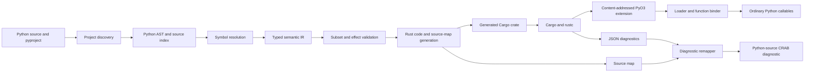
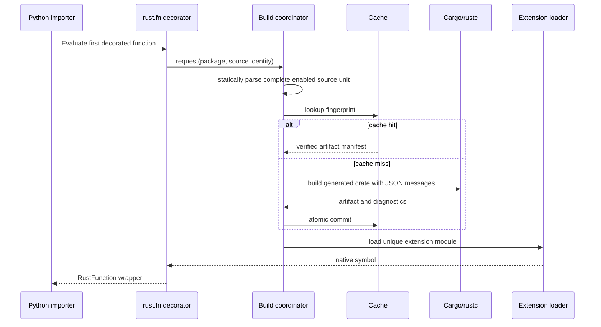

# Crabwalk Architecture Plan

> [!summary] Recommended baseline
> Start with a Python control plane and compiler frontend, a small source-spanned semantic IR, deterministic Rust generation, Cargo as the build engine, and PyO3 as the ABI. Use one content-addressed native extension per Crabwalk-enabled Python distribution fingerprint. Compile eagerly when the first rust.fn decorator in a source unit is evaluated, while exposing the exact same pipeline through explicit CLI commands.

This is a provisional implementation architecture for [[Crabwalk Product Contract]]. It is intentionally optimized for proving correctness and evolving the language contract, not for prematurely moving the compiler itself into Rust.

## Architectural goals

- One semantic pipeline for CLI builds, import-time builds, inspection, and packaging.
- Static analysis without importing or executing user modules.
- Explicit package/module/symbol identities derived from Python’s module system.
- Source spans and boundary effects preserved through every compiler stage.
- Real Rust source and a real Cargo project as stable inspection artifacts.
- rustc remains the final authority for Rust semantics.
- Content-addressed, concurrency-safe builds that can be loaded more than once in a development process.
- A small, versioned ABI between generated Rust and Python wrappers.
- No silent fallback path.

## System map

## Implementation split

### Python control plane

The first implementation should place these responsibilities in Python:

- CLI and configuration
- Project/package discovery
- Source reading and Python AST parsing
- Decorator/import/crate-declaration discovery
- Symbol tables and supported-subset validation
- Semantic IR
- Deterministic Rust code generation
- Fingerprints, build orchestration, cache metadata, and file locks
- Cargo JSON parsing
- Extension discovery/loading and Python wrapper metadata
- CRAB diagnostic rendering

Why: these areas will change rapidly while the source contract is being discovered. Python’s standard AST already supplies source locations, and a Python implementation minimizes bootstrapping work.

### Generated Rust

Generated crates own:

- Native implementations of rust.fn functions
- Rust types, control flow, ownership, and crate calls
- PyO3 export wrappers
- Boundary conversion glue
- Python-call boundary helpers
- Panic containment required by the ABI
- Native error-to-Python translation

### Possible later Rust compiler core

Moving parsing-adjacent analysis, IR validation, or code generation into Rust is a performance/refactoring decision, not an MVP requirement. It is justified only when:

- profiles identify the Python compiler as material latency;
- the IR schema and diagnostics contract are stable;
- the change preserves deterministic output and source maps; and
- the additional native bootstrap does not make Crabwalk harder to install or develop.

## Compiler pipeline and stage contracts

| Stage | Input | Output | Must not do |
|---|---|---|---|
| Project discovery | Explicit path, importer context, pyproject | ProjectRoot, package roots, config, relative module identities | Import user code |
| Source index | UTF-8 Python files | Immutable SourceFile records, line index, hashes | Normalize away source offsets |
| AST parse | SourceFile | CPython AST with validated positions | Extend Python grammar |
| Declaration discovery | AST | rust.fn declarations, imports, crate declarations, supported constants | Execute declarations |
| Symbol resolution | Declarations and package graph | Stable SymbolId table and resolved paths | Guess dynamic Python behavior |
| Semantic lowering | Resolved AST | Source-spanned PackageIR | Emit Rust strings directly |
| Validation/effects | PackageIR | Validated IR plus typed native/boundary/safety effects and placement invariants | Accept an unsupported node for convenience |
| Code generation | Validated IR | Rust files, Cargo inputs, generated-range map | Lose source identity |
| Build | Generated unit and controlled build config | Artifact, Cargo/rustc messages, build manifest | Scrape human-only compiler output |
| Load/bind | Artifact manifest and Python function identity | RustFunction callable/descriptor | Re-run source semantics in Python |
| Diagnostic mapping | CRAB/rustc event plus maps | User-facing diagnostic | Hide the original rustc code/detail |

## Core data model

All identifiers are stable within one build fingerprint and serializable for snapshots.

    SourceFile
      project_relative_path
      raw_utf8_hash
      text
      line_start_offsets

    SourceSpan
      source_file_id
      utf8_byte_start
      utf8_byte_end
      line_start / column_start
      line_end / column_end

    SymbolId
      python_module
      qualified_name
      symbol_kind

    TypeRef
      rust_path
      type_arguments
      ownership_mode
      boundary_capability

    FunctionIR
      symbol_id
      source_span
      parameters
      return_type
      basic_blocks or structured statements
      direct and dispatch call_edges
      effects

    PackageIR
      schema_version
      package_identity
      modules
      functions
      Rust dependencies
      Python dependencies used at boundaries

Every accepted operation carries a source span. Each function carries a typed,
transitively propagated effect set derived from its expressions and statements:

- NativeRust
- ConversionBoundary with cost/allocation metadata
- PythonRuntime with target metadata
- Blocking and ThreadSpawn
- GlobalMutation, UnsafeMemory, and UnsafeFfi
- MayPanic

Unsupported source is a source-spanned diagnostic, not an effect that may reach
code generation.

### Structured IR first

Use structured statements for M1/M2 because the accepted Python subset is structured. Introduce a control-flow graph only when definite assignment, loops, early returns, and borrow diagnostics make it beneficial. Do not make a heavyweight SSA representation a prerequisite for Fibonacci.

### Type-checking boundary

Crabwalk resolves:

- declared types;
- symbol kinds and Rust paths;
- whether an operation belongs to the supported surface;
- boundary conversion availability;
- obvious arity and contextual-literal errors; and
- semantic place roots plus shared/mutable/owned receiver capability; and
- enough type information for useful code generation.

rustc resolves:

- Rust trait/method applicability;
- full inference;
- borrow and lifetime validity;
- monomorphization;
- crate item existence; and
- final Rust type correctness.

This keeps Crabwalk from becoming a second Rust compiler while still making failures understandable at Python source.

## Project and package discovery

### M1

- An explicit file path is the compilation unit presented to the frontend.
- Its module identity is derived from an explicit CLI argument or its import-time __module__ identity.
- The build unit is still represented as a one-module PackageIR so package-wide expansion does not require a new IR shape.

### M2 and later

Recommended discovery order:

1. An explicit CLI project/package option.
2. The nearest pyproject.toml with a [tool.crabwalk] table.
3. The nearest Python package root containing the importing module.
4. Otherwise, fail with a project-discovery diagnostic rather than scanning an unbounded tree.

The Python package graph is authoritative. Static analysis follows only imports necessary to resolve Crabwalk declarations and Rust symbols. It does not import modules or execute `__init__.py`, but cycle analysis models every parent-package initializer Python would execute for a child import. Internal cycles and star imports are rejected for the alpha contract.

### Proposed configuration

    [tool.crabwalk]
    packages = ["src/myapp"]
    build-profile = "dev"
    python-boundaries = "warn"
    generated-dir = ".crabwalk/generated"
    cache-dir = ".crabwalk/cache"

Only stable user choices belong in configuration. Derived values such as target triple, extension suffix, and compiler hashes belong in build metadata.

## Static source discovery

Recognize declarations by AST shape and resolved import identity, not by arbitrary runtime values:

- from crabwalk import rust
- @rust.fn
- @rust.struct and @rust.enum in their later milestones
- rust.crate calls assigned to package-level names
- imports/re-exports that connect those symbols

Aliases for the rust namespace can be added later, but M1 should require the canonical spelling. A diagnostic can explain that the restriction is temporary and improves deterministic static resolution.

Crate declaration arguments must be literals in M4. Running Python to calculate a crate version, feature, path, or Git reference would make static builds non-reproducible and would execute user code.

## Compile and load lifecycle

The proposed import path is eager at the first decorator but source-driven:

Important properties:

- The decorator’s Python function object supplies identity and wrapper metadata, not the body to compile.
- The source file is parsed as a whole, so functions defined later in the file and recursion are known before compilation.
- Later decorators in the same fingerprint reuse the loaded extension.
- A compile failure aborts import with a Crabwalk compilation exception. It never returns the original Python function.
- CLI check/build/expand calls the same compiler service without importing the module.

### Fallback if the eager-decorator spike fails

The safe fallback is an explicit crabwalk build followed by ordinary import of prebuilt artifacts. A meta-path import hook is a later option, not the first implementation: import hooks add recursion, package-cycle, reload, and debuggability risks. The M0 spike decides whether eager decoration is reliable enough for the first alpha.

## Generated crate and module identity

One generated Cargo crate represents one Crabwalk-enabled Python package/distribution.

    .crabwalk/
      generated/
        myapp/
          <fingerprint>/
            Cargo.toml
            Cargo.lock
            src/
              lib.rs
              app.rs
              models.rs
            crabwalk-source-map.json
            crabwalk-build-inputs.json
      cache/
        artifacts/
          <fingerprint>/
            artifact-manifest.json
            <native extension>
      target/
        <toolchain-target-key>/

Generated source and built artifacts are disposable. The dependency lock policy becomes user-visible in M4 so deleting the cache cannot silently change dependency resolution.

### Extension naming

The native filename and PyO3 module initialization name must match. Generate a valid unique name such as:

    _crabwalk_myapp_a13f9029c8b4

The fingerprint suffix permits multiple builds to coexist in one Python process, which avoids relying on extension-module unloading or replacement. The full hash remains in metadata; a collision-safe longer suffix is used when needed.

### Export naming

Native exports receive collision-free internal names derived injectively from
module-path components plus the Python qualified name. Components are encoded
independently rather than joined with a replaceable delimiter, so `a__b.value` and
`a.b.value` cannot collide. Ownership wrappers use a structural type hash. Before
emission, one table validates the generated value, type, method-glue, Cargo-key,
and crate-binding namespaces. Runtime/FFI items and mandatory PyO3 have internal
identities that user declarations cannot shadow.

Python receives a RustFunction wrapper that preserves:

- __name__
- __qualname__
- __module__
- __doc__
- __annotations__ for Python tooling
- __wrapped__ only if doing so cannot expose an executable fallback
- a Crabwalk metadata handle for show/inspect

The original Python function must not remain callable through the wrapper.

## Deterministic Rust generation

### Code writer

Use a dedicated token/indent writer rather than concatenating ad hoc strings. It should:

- emit stable ordering by Python module and source declaration order;
- normalize generated newlines independently of source newline style;
- escape identifiers and literals correctly;
- assign a GeneratedRange to every user-derived token group;
- make helper/wrapper code clearly separate from user-derived code; and
- include compiler/IR schema metadata in a header.

Do not run rustfmt in the critical generation path until source maps can be recomputed after formatting. Initially, generate readable canonical formatting directly. A display-only formatted copy must never be mistaken for the mapped build source.

### Lowering patterns

Prefer boring, explicit Rust:

- Introduce temporaries when needed to preserve single evaluation and source order.
- Generate an internal native function separate from the PyO3 wrapper.
- Let Rust infer local types where safe, but emit declared public types exactly.
- Generate direct native calls for rust.fn call edges.
- Generate explicit boundary helper calls for conversions and Python runtime calls.
- Never lower a Python container into a Rust container implicitly.

## Source maps and diagnostics

Python AST expression/statement nodes provide source positions. Store UTF-8 byte offsets as the canonical source coordinate and derive line/column views from the SourceFile index.

### Map generation

The Rust writer records:

    generated file + byte range
      → original SourceSpan
      → SymbolId
      → lowering kind

Generated-only wrapper ranges map to the decorated function or declaration with a “generated ABI wrapper” label rather than pretending they came from a particular body expression.

### rustc ingestion

- Invoke Cargo with machine-readable JSON messages.
- Parse compiler-message events and nested rustc spans.
- For spans in generated files, choose the narrowest overlapping source-map range.
- Preserve rustc severity, code, labels, suggestions, and related spans.
- Render the original Python span first.
- Show generated Rust and the raw compiler rendering as expandable secondary context.
- If mapping fails, report both the nearest function source span and the exact generated span; never fabricate precision.

### Crabwalk diagnostics

Subset and resolution errors should be produced before Rust generation. They use the same SourceSpan and rendering machinery as mapped rustc errors, so users do not experience two unrelated error formats.

## Cargo/build integration

### Development builds

Call Cargo directly for generated user crates:

- cargo metadata with an explicit format version when dependency/package data is needed;
- cargo check for check;
- cargo build with JSON message output for build;
- artifact paths read from Cargo events, never guessed from target-directory conventions.

This provides structured diagnostics and artifact identities without making maturin part of every import-time cache miss.

### Crabwalk distribution and user wheels

- The Crabwalk compiler can begin as a normal Python package because its first compiler core is Python.
- Generated extensions use PyO3.
- Maturin is the recommended first packaging integration for mixed Python/Rust wheel prototypes.
- A future Crabwalk PEP 517 backend may orchestrate package-wide code generation before delegating/building, but backend composition is not on the M1 path.
- Start with interpreter-specific extension builds. Decide abi3/abi3t only after the used PyO3 API, free-threaded Python policy, and performance tradeoffs are measured.

### Controlled environment

Builds must either sanitize or fingerprint environment values that change Rust output, including target, profile, compiler flags, linker selection, and relevant Cargo configuration. Untracked ambient RUSTFLAGS or target configuration cannot be allowed to create a falsely reusable artifact.

## Cache design

### Fingerprint inputs

Use a schema-versioned canonical serialization and SHA-256. Include:

- raw bytes and project-relative identities of all relevant Python sources;
- resolved package/module graph;
- Crabwalk configuration;
- semantic IR schema and Rust codegen schema versions;
- Crabwalk compiler/runtime protocol version;
- generated runtime template hash;
- rustc and Cargo verbose version information;
- host and target triples;
- Python implementation, version, ABI flags, and extension suffix;
- complete generated dependency specification, including mandatory PyO3 and its
  internal alias;
- build profile and controlled compiler/linker flags;
- crate declarations, features, sources, and dependency lock content for every
  compilation unit, including units with no user-declared crate;
- source-map format version.

Do not include timestamps. Absolute paths should be excluded unless they semantically affect path dependencies or compiler output.

### Cache states

| State | Behavior |
|---|---|
| Valid hit | Verify manifest/artifact identity, then let Cargo validate the complete generated dependency graph without republishing unchanged bytes. |
| Miss | Build in a unique staging directory and atomically publish the complete entry. |
| Concurrent same-key build | One process builds; others wait on a scoped lock and then verify the published entry. |
| Corrupt/incomplete entry | Quarantine or remove only that exact entry, then rebuild. |
| Compiler/schema change | Natural miss because the version/hash participates in the key. |
| Source-only irrelevant edit | Reuse is allowed only if static dependency analysis proves the file irrelevant; begin conservatively package-wide. |

### Dependency reuse

Use a shared Cargo target directory keyed by compatible toolchain/target/dependency context so content-addressed generated crates can reuse dependency builds. Artifact-cache correctness must not depend on Cargo’s internal cache behavior.

## PyO3 ABI boundary

Each exported function has two layers:

1. An internal Rust function with the exact Rust signature and no Python dependency unless the IR records a Python boundary.
2. A PyO3 wrapper that validates/converts inputs, contains panics, calls the native function, converts the result, and attaches Crabwalk exception context.

### ABI rules

- Convert all arguments before releasing Python runtime access.
- Release the GIL for a Rust-only call when supported and safe; reacquire only at an explicit Python boundary.
- A Python boundary is an effect in the function/call graph so wrappers know runtime access is required.
- Method, trait, operator, and function-pointer dispatch carry exact or possible
  target symbols so effects propagate through every accepted call form.
- Reject Python-runtime effects before emission in generated contexts whose current
  signatures cannot carry `PyResult`, including methods/operators, native async
  helpers, iterator closures, function-pointer targets, and workers.
- Never let a Rust panic cross the extension ABI. The exact PyO3 behavior is verified by an end-to-end panic test rather than assumed.
- Conversion errors identify the Python parameter or return slot and expected Rust type.
- Result::Err and ownership-state errors use dedicated Crabwalk Python exception classes.
- Borrowed inputs may not be retained beyond their proven call lifetime.
- M1/M2 wrappers are generated per concrete function signature; a general dynamic conversion engine is unnecessary.

## Crate integration architecture

M4 begins with static path lowering, not general Rust reflection.

    regex = rust.crate("regex", version="1")

    @rust.fn
    def contains_number(value: rust.Str) -> rust.bool:
        expression = regex.Regex.new(r"\d+")
        return expression.is_match(value)

The resolver can lower:

- regex.Regex to regex::Regex;
- a type-associated call named new to Regex::new;
- a receiver method to Rust method syntax; and
- let rustc confirm the item, method, type, and trait resolution.

This proves ecosystem participation without claiming Crabwalk understands every crate API. General symbol metadata, overloaded associated items, traits, macros, re-exports, feature-gated APIs, and Python-invalid Rust identifiers require separate designs.

### Dependency declarations

- Parse only literal name/version/features/path/git/rev/tag/branch values.
- Resolve relative path dependencies against a documented package root.
- Generate Cargo.toml deterministically.
- Keep canonical Cargo package keys where procedural macros require them, while
  mapping Python source bindings to component-injective internal Rust aliases.
- Surface the exact dependency declaration and Cargo resolution errors.
- Preserve complete generated Cargo lock content, including mandatory PyO3, in a
  stable user-committable location for every compilation unit.
- Support locked and offline builds.
- Warn that Cargo dependencies and build scripts are executable supply-chain inputs; Crabwalk does not sandbox them.

## Runtime namespace

src/crabwalk/rust.py supplies runtime objects needed for valid Python execution:

- fn decorator
- marker objects for primitive types
- subscription support for generic markers such as Vec[T]
- constructors/helpers explicitly in the active contract
- std/crate proxy objects carrying static metadata

These objects are authoring/runtime metadata, not Python implementations of Rust semantics. Calling a Rust-only operation outside a compiled context should fail clearly unless the product explicitly defines a Rust-owned Python wrapper for it.

## Proposed repository layout

    pyproject.toml
    README.md
    src/
      crabwalk/
        __init__.py
        rust.py
        cli.py
        config.py
        diagnostics.py
        runtime.py
        compiler/
          project.py
          source.py
          discover.py
          symbols.py
          types.py
          ir.py
          lower.py
          validate.py
          codegen.py
          source_map.py
        build/
          fingerprint.py
          cargo.py
          cache.py
          loader.py
          locks.py
        templates/
          generated_crate/
    tests/
      unit/
      golden/
      compile/
      runtime/
      diagnostics/
      fixtures/
    examples/
      fibonacci/
      core_types/
      python_boundary/
      crates_regex/
      ownership/
    docs/
      language/
      commands/
      diagnostics/
      internals/

Keep modules small enough that IR, codegen, build, and loading can be tested independently. Do not create a separate package for every conceptual box before those seams exist in code.

## Command architecture

All frontends call one application service:

    CompilationRequest
      mode: check | build | expand | inspect
      project/source target
      Python ABI context
      build policy
      diagnostic policy

    CompilationResult
      fingerprint
      PackageIR summary
      generated manifest
      artifact manifest (when built)
      diagnostics
      cache status

The CLI renders this result. The decorator requests build mode and binds symbols. A future build backend requests build/package mode. This prevents behavior drift.

## Provisional architecture decisions

| ID | Recommendation | Status | Validation evidence required |
|---|---|---|---|
| ADR-001 | Python frontend/control plane for M1–M3 | Proposed | Fibonacci profile and maintainability review |
| ADR-002 | One generated Cargo crate per Python distribution | Accepted from brief, implementation details proposed | Cross-module fixture |
| ADR-003 | Eager source-driven compile at first rust.fn decoration | Proposed | Import, recursion, reload, and error spike on all initial OSes |
| ADR-004 | Content-addressed extension module names | Proposed | Two fingerprints load in one process |
| ADR-005 | Source-spanned semantic IR before Rust text | Accepted from brief | Golden IR and mapped rustc error |
| ADR-006 | Direct Cargo for development; maturin for first wheel prototype | Proposed | Artifact/diagnostic and clean-wheel spikes |
| ADR-007 | Interpreter-specific ABI first; defer stable ABI choice | Proposed | PyO3 API inventory and CI build-cost data |
| ADR-008 | Static source analysis never imports user modules | Proposed | Package/crate declarations work from AST-only fixtures |
| ADR-009 | Deterministic internal formatter before rustfmt integration | Proposed | Byte-identical expand test and accurate expression map |
| ADR-010 | Conservative package-wide invalidation first | Proposed | Correctness tests; refine only with measured rebuild pain |

Formal acceptance/rejection and owner/date fields live in [[Crabwalk Risks and Decisions]].

## Architecture fitness tests

The architecture is healthy only if automated tests continuously prove:

1. CLI and decorator builds produce the same fingerprint and generated code.
2. Unsupported syntax cannot reach code generation.
3. Every user-derived generated range maps to a valid Python SourceSpan.
4. Byte-identical inputs produce byte-identical generated output and fingerprints.
5. Every valid cache hit lets Cargo validate the mandatory generated dependency
   graph without needlessly relinking or republishing.
6. Two changed fingerprints can load and execute in one Python process.
7. Native-to-native calls do not acquire Python runtime access.
8. A Python-boundary call is present in IR, generated helpers, and inspect output.
9. A rustc error maps to the intended Python expression and keeps its Rust code.
10. Cache corruption cannot load an unverified artifact.
11. Every accepted dispatch edge participates in effect propagation and boundary
    placement validation.
12. Shared receivers cannot reach mutable/consuming methods, and generated emitted
    identifiers are unique before Rust code generation.
13. A Cargo lock update cannot publish an artifact under the previous lock hash.

## Primary implementation references

- [Python AST source locations](https://docs.python.org/3/library/ast.html) — statement/expression line and UTF-8 column metadata.
- [Cargo support for external tools](https://doc.rust-lang.org/cargo/reference/external-tools.html) — versioned metadata plus JSON build and compiler messages.
- [Cargo metadata format](https://doc.rust-lang.org/stable/cargo/commands/cargo-metadata.html) — package/dependency data and explicit format versioning.
- [PyO3 Python modules](https://pyo3.rs/main/module) — extension initialization and the requirement that the module name match the native filename.
- [PyO3 build and distribution](https://pyo3.rs/main/building-and-distribution) — native-extension build requirements and ABI options.
- [Maturin mixed-project layout](https://www.maturin.rs/project_layout.html) — mixed Python/Rust packaging and internal extension submodule layout.
- [Python Packaging User Guide](https://packaging.python.org/en/latest/guides/writing-pyproject-toml/) — standardized project/build-system configuration.
