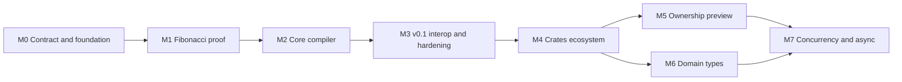

# Crabwalk Roadmap

This is the canonical work breakdown for [[Crabwalk Project Hub]]. It implements the contract in [[Crabwalk Product Contract]] through the architecture in [[Crabwalk Architecture Plan]].

## Estimation model

Sizes are relative engineering effort for one experienced compiler/tooling engineer:

| Size | Typical effort | Meaning |
|---|---:|---|
| XS | Less than 1 day | Local, understood change |
| S | 1–2 days | Small feature with direct tests |
| M | 3–5 days | Several components or meaningful edge cases |
| L | 1–2 weeks | Cross-cutting slice or uncertain integration |
| XL | More than 2 weeks | Must be split after a research spike |

Milestone ranges include implementation and normal tests, not waiting time, release support, or major redesign. Add 30–50% contingency until M1 retires the import/build/load and source-map risks. Re-estimate the remaining roadmap after each milestone; do not treat these as calendar promises.

## Milestone map

| Milestone | Outcome | Estimated effort | Hard dependency |
|---|---|---:|---|
| M0 | Contract, key spikes, scaffold, test harness | 2–3 engineering-weeks | None |
| M1 | Complete native Fibonacci proof | 4–7 engineering-weeks | M0 |
| M2 | Core typed language and package graph | 8–13 engineering-weeks | M1 |
| M3 | Interop, diagnostics, cache, packaging; v0.1 alpha | 7–11 engineering-weeks | M2 |
| M4 | crates.io ecosystem proof | 6–10 engineering-weeks | M3 |
| M5 | Ownership across Python preview | 10–16 engineering-weeks | M4 and ownership design review |
| M6 | Struct/enum domain model preview | 8–14 engineering-weeks | M4; parts can overlap M5 |
| M7 | Parallelism/async research and later delivery | Unestimated | Semantic and ABI stability |

The credible v0.1 alpha envelope is therefore roughly 21–34 engineering-weeks for one engineer before contingency. M1 is the first reliable re-estimation point.

## Dependency overview

# M0 — Contract and foundations

## Objective

Remove the decisions most likely to invalidate an implementation, establish a runnable repository, and create the test machinery used by every later slice.

## Work items

- [ ] **GOV-001 — Establish project governance and support intent** (S)
  - Depends: none
  - Decide owner(s), license, contribution model, release channel, security contact, and whether the first release is research-preview or supported alpha.
  - Acceptance: decisions are recorded with owner/date and surfaced in repository metadata.

- [x] **SPEC-001 — Ratify the M1 and v0.1 language contract** (M)
  - Depends: GOV-001 for final owner
  - Review every Supported/Deferred item in [[Crabwalk Product Contract]], especially integer division, overflow, None/Option, return annotations, mutability, panics, and Result at Python boundaries.
  - Acceptance: contract status is Accepted; each unresolved item has a decision ID and deadline.

- [x] **ADR-001 — Spike compile/load lifecycle** (L)
  - Depends: SPEC-001 M1 surface
  - Build the smallest hand-written PyO3 extension with a content-addressed module name; load two versions in one process; invoke the process from a decorator-shaped prototype on Windows, Linux, and macOS if available.
  - Acceptance: evidence confirms eager-first-decorator or selects explicit prebuild; module-name/file-name rules and reload limitations are recorded.

- [x] **ADR-002 — Spike Cargo diagnostics and source-map remapping** (M)
  - Depends: none
  - Generate a tiny Rust file from a Python fixture, invoke Cargo with JSON messages, and remap one known rustc span to the Python source.
  - Acceptance: original rustc code, labels, and mapped source can be rendered without scraping human output.

- [x] **FND-001 — Scaffold the repository** (M)
  - Depends: GOV-001
  - Add pyproject metadata, src layout, crabwalk/rust namespace skeleton, CLI entry point, test folders, examples, development dependency groups, formatting/lint/type-check configuration, and generated/cache ignore rules.
  - Acceptance: a clean environment installs the package and from crabwalk import rust succeeds.

- [x] **FND-002 — Implement toolchain discovery and doctor skeleton** (M)
  - Depends: FND-001
  - Detect Python implementation/ABI, rustc, Cargo, host/target, linker readiness, and writable Crabwalk directories with actionable failures.
  - Acceptance: doctor exits successfully on a configured machine and produces stable CRAB0xx failures for missing tools.

- [x] **TEST-001 — Create compiler fixture harnesses** (L)
  - Depends: FND-001
  - Support AST/discovery snapshots, IR snapshots, generated-Rust goldens, compile-pass, compile-fail, runtime, diagnostic, and cache-observation fixtures.
  - Acceptance: one synthetic fixture runs through every harness layer; golden updates are explicit.

- [x] **CI-001 — Establish foundation CI** (M)
  - Depends: FND-001, TEST-001
  - Run Python checks and non-native compiler tests on all intended OSes; run one PyO3 smoke build on at least Windows and Linux; cache dependencies without using cached project artifacts as test evidence.
  - Acceptance: branch protection can require a stable CI job set.

- [x] **DOC-001 — Document contributor bootstrap** (S)
  - Depends: FND-001, FND-002
  - Document prerequisites, environment creation, test commands, fixture conventions, generated artifact locations, and diagnostic debugging.
  - Acceptance: a new clean environment reaches the smoke test using only the guide.

## Exit gate

M0 is complete when:

- M1 semantics are accepted.
- The eager-decorator approach is either validated or replaced with a documented explicit-build path.
- One rustc error is successfully remapped from generated Rust to Python.
- The package installs and doctor runs on the initial CI platforms.
- The fixture harness can distinguish pass, fail, runtime, diagnostic, and cache evidence.

## Demonstration

Run doctor, generate/build/load a hand-written native add function through the lifecycle spike, load a second fingerprint in the same process, and show a mapped compiler error.

# M1 — End-to-end compiler proof

## Objective

Compile the north-star Fibonacci fixture from actual Python AST, load it as a native Python callable, and prove strict failure, inspection, source mapping, and caching.

## Work items

- [x] **FE-001 — Build immutable source index and single-module project model** (M)
  - Depends: FND-001
  - Read UTF-8 source, preserve raw byte offsets, derive stable module identity, and index line starts.
  - Acceptance: Unicode identifiers/comments and CRLF/LF fixtures retain correct AST/source spans.

- [x] **FE-002 — Discover canonical rust import and rust.fn declarations** (M)
  - Depends: FE-001
  - Identify module-level decorated functions without executing the module; reject aliases, nested functions, decorator conflicts, and unsupported signatures with exact spans.
  - Acceptance: positive and negative discovery snapshots cover each rule.

- [x] **SYM-001 — Implement M1 symbol and type resolution** (M)
  - Depends: FE-002
  - Resolve rust.u64, parameters, local function identity, and recursive call targets.
  - Acceptance: unresolved names and wrong annotations fail before code generation.

- [x] **IR-001 — Define source-spanned M1 IR** (L)
  - Depends: FE-001, SYM-001
  - Represent package/module/function, u64 type, literals, names, add/subtract, comparison, if, return, and native call with serializable source spans/effects.
  - Acceptance: Fibonacci has a stable human-reviewable IR golden; every user node has a span.

- [x] **LOW-001 — Lower the accepted Python AST into IR** (L)
  - Depends: IR-001
  - Apply contextual integer typing and build recursive call edges.
  - Acceptance: accepted nodes lower; every other body node produces CRAB102 and never reaches codegen.

- [x] **VAL-001 — Validate M1 control flow and signatures** (M)
  - Depends: LOW-001
  - Check parameter/return annotations, boolean conditions, arity, and all-path returns.
  - Acceptance: missing return, wrong call arity, invalid condition, and out-of-contract operation have focused diagnostics.

- [x] **CG-001 — Generate deterministic native Rust** (L)
  - Depends: VAL-001, ADR-002
  - Generate Cargo.toml, internal Fibonacci function, module initializer, wrapper stubs, and deterministic source ranges.
  - Acceptance: repeated expand output is byte-identical and compiles after ABI-001 lands.

- [x] **ABI-001 — Generate checked PyO3 u64 wrapper** (L)
  - Depends: ADR-001, CG-001
  - Convert Python int to u64 with type/range errors, call the internal native function, and convert the result.
  - Acceptance: normal, negative, too-large, and wrong-type inputs behave according to the product contract; recursion is native.

- [x] **BUILD-001 — Implement Cargo check/build runner** (L)
  - Depends: FND-002, CG-001
  - Use controlled environment, explicit target directory, machine-readable messages, timeout/cancellation handling, and artifact discovery from Cargo events.
  - Acceptance: check and build return structured CompilationResult data on all initial CI platforms.

- [x] **MAP-001 — Generate and consume expression-level source maps** (L)
  - Depends: CG-001, BUILD-001
  - Record generated ranges and remap compiler events to the narrowest Python span.
  - Acceptance: a deliberately invalid accepted expression points to the correct Python tokens and retains the rustc code.

- [x] **DIAG-001 — Implement initial CRAB diagnostic framework** (L)
  - Depends: FE-001, VAL-001, MAP-001
  - Add CRAB0xx/1xx/3xx/4xx models, text renderer, related spans, suggestions, and compilation exception.
  - Acceptance: missing tool, unsupported AST, type/signature failure, Cargo failure, and load failure use one consistent format.

- [x] **CACHE-001 — Implement content fingerprint and verified artifact cache** (L)
  - Depends: CG-001, BUILD-001
  - Canonicalize inputs, hash all M1-relevant versions/config, store manifest plus artifact hash, and publish atomically.
  - Acceptance: an unchanged second-process build lets Cargo validate the complete
    mandatory dependency graph without relinking or republishing; relevant
    source/toolchain/schema/lock edits miss.

- [x] **LOAD-001 — Load content-addressed extension and bind RustFunction** (L)
  - Depends: ADR-001, ABI-001, BUILD-001, CACHE-001
  - Load the exact artifact using a matching extension/PyO3 module name; bind native symbol; preserve safe Python metadata without exposing fallback.
  - Acceptance: two fingerprints execute in one process and wrapper inspection identifies generated/native metadata.

- [x] **API-001 — Connect rust.fn to the shared compiler service** (M)
  - Depends: LOAD-001, DIAG-001
  - Trigger/reuse the package build at decoration time and return the native wrapper.
  - Acceptance: ordinary import of the fixture either returns a compiled callable or fails compilation; original body cannot execute.

- [x] **CLI-001 — Deliver doctor/check/build/expand minimum commands** (M)
  - Depends: BUILD-001, CACHE-001, DIAG-001
  - Route all modes through the same CompilationRequest service as API-001.
  - Acceptance: CLI and decorator produce identical fingerprints and generated code.

- [x] **E2E-001 — Lock the Fibonacci acceptance suite** (L)
  - Depends: all M1 implementation tasks
  - Add clean/cached runtime, native recursion, invalid input, unsupported syntax, missing return, mapped rustc error, and deterministic expansion cases.
  - Acceptance: the suite passes from a clean checkout on the initial support matrix.

## Exit gate

M1 is complete only when all North-star criteria in [[Crabwalk Project Hub#North-star acceptance scenario]] pass and:

- no generated source is hand-written for the demonstration;
- no accepted function can fall back to its Python body;
- the cache hit is observed in a fresh process;
- generated Rust and mapping metadata are inspectable;
- a second fingerprint loads beside the first; and
- all failures use source-located structured diagnostics.

## Demonstration

From a clean environment: run doctor; expand Fibonacci; import and call it; prove native recursion; rerun in a new process and show cache hit; introduce one unsupported expression and one Rust type error and show both Python-located diagnostics.

# M2 — Core typed compiler

## Objective

Grow the technical proof into the useful native language subset defined by [[Crabwalk Product Contract#v0.1 source surface]], including multiple Rust functions/modules and core Rust data types.

## Work items

- [x] **CFG-001 — Add explicit project/package configuration** (M)
  - Depends: M1
  - Implement pyproject [tool.crabwalk] parsing, bounded root discovery, package roots, and stable relative module IDs.
  - Acceptance: src-layout and flat-layout fixtures resolve identically across OS path conventions.

- [x] **MOD-001 — Build static Python package/import graph** (L)
  - Depends: CFG-001
  - Resolve relative/absolute imports and re-exports needed by Rust symbols without importing modules.
  - Acceptance: two-module rust.fn calls and __init__.py re-export fixtures compile into one crate; import cycles fail or resolve deterministically.

- [x] **CG-002 — Generate package-wide Rust module tree** (L)
  - Depends: MOD-001
  - Produce stable Rust modules, visibility, collision-safe names, and one PyO3 module for the distribution.
  - Acceptance: Python module identities survive in wrapper metadata and generated inspection.

- [x] **TYPE-001 — Complete primitive type matrix** (L)
  - Depends: M1 IR/codegen
  - Add signed/unsigned integer widths, f32/f64, bool, and unit with checked ABI conversions.
  - Acceptance: boundary min/max, wrong-type, precision, and output cases exist for every primitive.

- [x] **SEM-001 — Implement literal/operator semantics** (L)
  - Depends: TYPE-001, SPEC-001
  - Add numeric/bool/string literals, allowed binary/unary/comparison/boolean operations, contextual typing, and stable overflow profile.
  - Acceptance: every operator/type pair is either tested Supported or tested Rejected.

- [x] **SEM-002 — Implement locals, rebinding, and definite assignment** (L)
  - Depends: IR-001, SEM-001
  - Analyze immutable/mutable bindings, branch joins, type-stable rebinding, and use-before-assignment.
  - Acceptance: generated mut is minimal and inspectable; branch/loop edge cases have diagnostics.

- [x] **SEM-003 — Implement control-flow subset** (L)
  - Depends: SEM-002
  - Add if/else, while, integer range for, break, continue, and early return.
  - Acceptance: nested loops/branches compile, and all exit/definite-assignment cases are covered.

- [x] **CALL-001 — Generalize native call graph** (L)
  - Depends: MOD-001, TYPE-001
  - Support local and cross-module rust.fn calls, mutual recursion when legal, topological metadata, and per-function effects.
  - Acceptance: all native call edges remain within Rust and preserve source spans.

- [x] **TYPE-002 — Implement String and Str** (L)
  - Depends: TYPE-001, ABI-001
  - Add contextual string literals, owned String, call-duration Str parameters, selected methods, and allocating/borrowed boundary metadata.
  - Acceptance: no borrowed string can escape; Unicode and embedded-NUL behavior is tested.

- [x] **TYPE-003 — Implement concrete Vec[T]** (L)
  - Depends: TYPE-001, SEM-002
  - Add explicit construction, new/with_capacity/push/pop/len/is_empty, supported element types, and internal move behavior.
  - Acceptance: Vec is a real Rust Vec in generated source; Python list is never silently substituted.

- [x] **TYPE-004 — Implement Option[T]** (M)
  - Depends: TYPE-001, TYPE-002 as applicable
  - Add contextual None, rust.Some, selected methods, branch typing, and boundary conversion.
  - Acceptance: Option stays native inside Rust and converts predictably only at the Python boundary.

- [x] **TYPE-005 — Implement basic Result[T, E]** (L)
  - Depends: TYPE-004, ABI error design
  - Add rust.Ok/rust.Err, selected methods, internal return flow, and provisional exported Err mapping.
  - Acceptance: Err never silently panics/defaults; the Python exception includes stable type/context.

- [x] **STD-001 — Add versioned standard-library symbol allowlist** (L)
  - Depends: symbol resolver, types
  - Resolve selected std paths and rust.println while preserving the exact Rust path in IR.
  - Acceptance: unknown paths fail clearly; supported symbols lower to actual std items.

- [x] **DIAG-002 — Expand semantic diagnostic catalog** (L)
  - Depends: all M2 semantic tasks
  - Cover type mismatch context, truthiness, division differences, rebinding, missing return, unresolved import/symbol, unsupported methods, and move-related rustc errors.
  - Acceptance: each Supported feature has at least one paired misuse diagnostic.

- [x] **E2E-002 — Core-language example suite** (L)
  - Depends: all M2 tasks
  - Add numeric/control-flow, strings, Vec, Option, Result, cross-module, re-export, and std examples.
  - Acceptance: examples are executable tests and generated source is published as golden evidence.

## Exit gate

- Every v0.1 M2 source form has positive and negative fixtures.
- A multi-module package compiles into one extension.
- Native call graphs do not acquire Python runtime access.
- Core types are real Rust values and have documented boundary conversion.
- No Str borrow escapes its valid lifetime.
- The generated project remains deterministic and source mapped.

# M3 — Interop, hardening, and v0.1 alpha

## Objective

Make the core compiler diagnosable, cache-safe, installable, and honest about Python interactions.

## Work items

- [x] **BND-001 — Make boundary effects first-class** (M)
  - Depends: M2 IR
  - Propagate Native/Conversion/Python/Unsupported effects through expressions and the call graph.
  - Acceptance: inspect output and wrapper behavior agree with IR effects.

- [x] **CONV-001 — Complete primitive conversion policy** (L)
  - Depends: TYPE-001, TYPE-002, TYPE-004
  - Standardize exception classes/messages, parameter paths, ranges, precision notes, Option behavior, and return conversion.
  - Acceptance: boundary test matrix passes across supported Python versions.

- [x] **CONV-002 — Add explicit container conversion helpers** (L)
  - Depends: TYPE-003, BND-001
  - Implement from_python/to_python for supported Vec types with indexed element errors and allocation diagnostics.
  - Acceptance: no implicit complex conversion occurs and inspect reports cost.

- [x] **PY-001 — Implement first Python runtime call boundary** (L)
  - Depends: BND-001, PyO3 ABI
  - Lower allowlisted print calls, attach/acquire Python runtime only where required, propagate Python exceptions, and compare against rust.println.
  - Acceptance: hello example reports one Python boundary and one native operation; native-only functions remain runtime-independent.

- [x] **ABI-002 — Harden panic, GIL, and error behavior** (L)
  - Depends: PY-001, TYPE-005
  - Verify panic containment, GIL release/reacquisition, Result error mapping, traceback context, and nested boundary failures.
  - Acceptance: no panic crosses the ABI and every error returns a documented Python exception.

- [x] **MAP-002 — Harden source maps and suggestions** (L)
  - Depends: M2 language surface
  - Support multi-file related spans, generated-helper fallback spans, Unicode columns, rustc suggestions, and mapping-version compatibility.
  - Acceptance: diagnostic goldens contain no unexplained generated location as the primary error.

- [x] **CACHE-002 — Harden cache and concurrency** (L)
  - Depends: package graph, BND-001
  - Add interprocess lock, atomic staging, manifest/artifact verification, corruption recovery, environment/config fingerprints, cancellation, and bounded cleanup API.
  - Acceptance: race, interrupted build, corrupt entry, source/config/toolchain changes, and valid-hit tests pass.

- [x] **CLI-002 — Complete show and inspect** (L)
  - Depends: BND-001, MAP-002, CACHE-002
  - Show per-symbol generated Rust; report effects, conversions, Python calls, fingerprints, dependencies, cache state, and build commands.
  - Acceptance: output is useful in text and machine-readable form.

- [ ] **PERF-001 — Establish performance baselines and budgets** (M)
  - Depends: stable cache/load path
  - Measure cold build, warm build, cached import, primitive call overhead, conversion cost, and native loop work against documented hardware/CI.
  - Acceptance: regression thresholds are evidence-based; cached import launches no compiler process.

- [x] **PKG-001 — Prototype clean wheel build** (L)
  - Depends: package-wide generated crate, ABI-002
  - Build/install a mixed Python/Rust wheel in an isolated environment using the selected packaging path.
  - Acceptance: installed package runs with no Cargo/rustc on the target machine and preserves Python module API.

- [ ] **CI-002 — Enforce supported platform matrix** (L)
  - Depends: PKG-001
  - Test lowest/latest supported Python, stable/minimum Rust, Windows/Linux/macOS, clean source build, wheel install, and cache behavior according to [[Crabwalk Verification and Release]].
  - Acceptance: release jobs are reproducible and required.

- [x] **SEC-001 — Document and test build trust boundary** (M)
  - Depends: BUILD-001
  - Threat-model generated paths, Cargo config/env, path dependencies, build scripts, cache poisoning, diagnostic terminal escapes, and untrusted project compilation.
  - Acceptance: security model states that Cargo code is not sandboxed and supplies locked/offline guidance.

- [x] **DOC-002 — Publish v0.1 language and tooling reference** (L)
  - Depends: stabilized M2/M3 behavior
  - Document syntax, semantic differences, conversions, commands, diagnostics, generated layout, cache, toolchain, examples, and limitations.
  - Acceptance: each Supported item links to a tested example; no Deferred feature is implied to work.

- [ ] **REL-001 — Cut v0.1 alpha** (M)
  - Depends: all M3 gates
  - Run release checklist, install artifacts in clean environments, publish compatibility/limitations/security notes, and record known issues.
  - Acceptance: [[Crabwalk Verification and Release#v0.1 alpha release gate]] passes.

## Exit gate

- M2 contract is complete and boundary effects are inspectable.
- Python print and Rust println prove the runtime/native distinction.
- Panic, Result, conversion, GIL, and error behavior are tested.
- Cache races and corruption cannot load the wrong artifact.
- A wheel installs and runs without a Rust toolchain on the consumer machine.
- The documented compatibility matrix passes.
- Security and supply-chain boundaries are explicit.

# M4 — crates.io ecosystem proof

## Objective

Allow a statically declared Rust dependency to participate naturally in a Python-authored Rust island without claiming general crate reflection.

## Work items

- [x] **CRATE-001 — Parse static rust.crate declarations** (L)
  - Depends: MOD-001, accepted syntax
  - Support explicit name plus literal version/features/path/git selectors with mutually exclusive source validation.
  - Acceptance: dynamic values and invalid combinations fail at the declaration span.

- [x] **CRATE-002 — Generate deterministic Cargo dependencies** (L)
  - Depends: CRATE-001
  - Escape names/features/paths, handle aliases, and include declarations in fingerprints.
  - Acceptance: generated manifest matches golden and Cargo metadata confirms the intended package/features.

- [x] **LOCK-001 — Establish dependency lock and offline policy** (L)
  - Depends: CRATE-002
  - Select a stable committable Cargo.lock location/copy flow; add locked/offline modes and cache invalidation.
  - Acceptance: deleting disposable artifacts does not change resolution when locked; offline rebuild succeeds with prepared Cargo cache.

- [x] **RPATH-001 — Lower crate paths and associated/method calls** (XL; split after spike)
  - Depends: CRATE-002, symbol resolver
  - Mechanically map resolved Python attribute paths to Rust module/type paths and method syntax while rustc remains final authority.
  - Acceptance: Regex::new and is_match compile; missing items/methods map cleanly to Python source.

- [x] **MOD-002 — Integrate package-local crate imports and re-exports** (L)
  - Depends: CRATE-001, MOD-001
  - Resolve from . import regex and façade re-exports without global rust namespace mutation.
  - Acceptance: declarations in __init__.py work from multiple package modules.

- [x] **DIAG-003 — Map Cargo resolution and crate API errors** (L)
  - Depends: LOCK-001, RPATH-001
  - Differentiate dependency resolution, feature, network/offline, path, missing item, and Rust type errors.
  - Acceptance: every failure points to either crate declaration or usage source as appropriate.

- [x] **SEC-002 — Add dependency/build-script controls and disclosure** (M)
  - Depends: CRATE-002
  - Expose exact Cargo command/dependency graph, avoid implicit credential disclosure, validate path scope, and document unsandboxed build scripts.
  - Acceptance: inspect shows the trust inputs; sensitive environment values are not printed.

- [x] **E2E-003 — Lock regex crates.io demonstration** (L)
  - Depends: all M4 tasks
  - Compile contains_number with regex, package it, run cached/offline/locked variants, and exercise a mapped crate API error.
  - Acceptance: milestone statement “an ordinary crates.io dependency participates naturally” is demonstrably true.

## Exit gate

- Crate declarations remain Python-package-local.
- Cargo is the resolver and its lock state is reproducible.
- Regex demonstration works from source and packaged form.
- Missing item/method and dependency failures map to Python.
- General macro/API reflection remains explicitly deferred.

# M5 — Ownership preview

## Objective

Deliver real ownership value both inside Rust islands and, for generated concrete wrapper types, across Python calls.

## Work items

- [x] **OWN-001 — Lower Owned/Ref/Mut in native signatures** (L)
  - Depends: M4 stable type paths
  - Map annotations to T, &T, and &mut T with legality rules and call-site lowering.
  - Acceptance: rustc validates real move/borrow behavior and errors map to Python.

- [x] **OWN-002 — Define Python-crossing ownership state machine** (L)
  - Depends: design review
  - Specify Alive, MutablyBorrowed, SharedBorrowed count, and Moved states; define which states can exist across a Python frame.
  - Acceptance: no state transition relies on Python reference counts to imply Rust exclusivity.

- [x] **WRAP-001 — Generate concrete Rust-owned wrapper classes** (XL; split by type)
  - Depends: OWN-002, stable PyO3 ABI
  - Begin with one concrete Vec element type; store owned value in an Option/state container and expose safe operations.
  - Acceptance: the underlying value is a real Rust allocation and every public operation checks state.

- [x] **MOVE-001 — Enforce moves across Python** (L)
  - Depends: WRAP-001
  - Taking Owned[T] atomically removes the value; later use raises CrabwalkMoveError with move-site context.
  - Acceptance: aliases to the same Python wrapper all observe Moved and cannot resurrect/duplicate the value.

- [x] **BORROW-001 — Enforce call-scoped shared/mutable borrows** (XL; split after spike)
  - Depends: WRAP-001, OWN-002
  - Permit safe call-duration borrows; reject overlapping mutable/shared access and reentrant Python boundary hazards.
  - Acceptance: no borrowed reference outlives the guard/call and adversarial reentrancy tests are safe.

- [x] **LIFE-001 — Reject unsupported lifetime exposure** (M)
  - Depends: BORROW-001
  - Diagnose returned/stored Ref/Mut, borrowed fields, and long-lived Python views not proven safe.
  - Acceptance: unsupported lifetime patterns cannot compile or escape through wrappers.

- [x] **THREAD-001 — Gate Send/Sync exposure** (L)
  - Depends: wrappers
  - Encode whether wrappers/functions can cross threads; test Python free-threaded and GIL-enabled assumptions separately if supported.
  - Acceptance: non-Send/non-Sync values cannot be used through an unsafe concurrency path.

- [x] **DIAG-004 — Add ownership-aware Python errors** (L)
  - Depends: MOVE-001, BORROW-001
  - Report moved values, conflicting borrows, definition/move/borrow sites, and suggested signature changes.
  - Acceptance: errors are actionable at Python source and preserve rustc codes when applicable.

- [x] **E2E-004 — Ownership adversarial suite** (XL)
  - Depends: all M5 tasks
  - Cover aliasing, double move, reentrancy, exception during borrow, threads, garbage collection, cycles, repeated conversion, and cache/reload type identity.
  - Acceptance: no use-after-move, dangling borrow, double-free, or unsound aliasing is observed under stress and sanitizing tools where practical.

## Exit gate

- Owned/Ref/Mut represent actual Rust signature semantics.
- At least one Rust-owned concrete wrapper preserves move state across Python aliases.
- Borrow guards cannot escape or survive reentrant unsafe use.
- Unsupported lifetime patterns are rejected.
- Ownership errors show both use and originating move/borrow context.

# M6 — Domain types

## Objective

Support typed Rust domain models authored with valid Python class syntax.

## Work items

- [x] **STRUCT-001 — Specify and lower rust.struct fields/visibility** (L)
- [x] **STRUCT-002 — Generate construction, field access, methods, and Python wrapper** (XL)
- [x] **ENUM-001 — Specify valid-Python enum/variant declaration syntax** (L)
- [x] **ENUM-002 — Generate unit/tuple/record variants and wrappers** (XL)
- [x] **MATCH-001 — Lower an exhaustive Python match subset to Rust match** (XL)
- [x] **DERIVE-001 — Support a narrow explicit derive path** (XL)
- [x] **DOMAIN-001 — Build Serde model/codec demonstration** (XL)
- [x] **DIAG-005 — Map construction, field, variant, exhaustiveness, and derive errors** (L)

Each item requires a dedicated syntax/ownership/boundary mini-contract before implementation. General macros and traits do not become implicitly supported through this milestone.

## Exit gate

- User and state-machine examples use real Rust structs/enums.
- Construction and field/variant access have defined Python ownership behavior.
- Match is exhaustive according to rustc and maps failures to Python patterns.
- A narrow Serde demonstration works without claiming arbitrary derive/macro support.

# M7 — Concurrency and async

M7 begins as research epics, not promises:

- Rayon/native parallel execution and boundary-free benchmarks
- Send/Sync diagnostic surfacing
- GIL-enabled versus free-threaded CPython policy
- Native threads and Rust-owned wrapper transfer
- Tokio runtime ownership
- Python event-loop bridge
- cancellation, context propagation, exception groups, and shutdown
- async lifetime and Future wrapper design

No concurrency syntax should be selected until M5 ownership rules and the ABI thread model are stable.

## Suggested first ten pull requests

Keep early changes small and independently reviewable:

1. Repository scaffold, rust namespace import, CLI shell, and doctor stubs.
2. SourceFile/span model plus AST/discovery goldens.
3. M1 symbols/types and source-spanned IR.
4. Fibonacci lowering plus Unsupported validator.
5. Deterministic Rust/Cargo expansion without building.
6. Cargo JSON check/build plus raw artifact manifest.
7. PyO3 u64 wrapper and explicit loader.
8. rust.fn integration with content-addressed module naming.
9. Fingerprint/cache plus second-process no-Cargo test.
10. Source-map diagnostics and full Fibonacci acceptance suite.

Avoid combining all ten into one branch: the review boundaries are part of risk control.

## Work that can proceed in parallel

After M0 decisions are stable:

- Compiler frontend/IR can proceed alongside the hand-written PyO3 lifecycle spike.
- Diagnostic rendering can proceed alongside codegen if both share SourceSpan.
- Cache infrastructure can proceed alongside build runner after fingerprint inputs are named.
- Documentation examples can be authored as failing acceptance fixtures before implementation.
- Cross-platform CI can expand while core semantic unit tests proceed.

Do not parallelize two independent implementations of the same semantic rule. The contract and fixture should be shared first.

## Definition of ready

A task is ready when:

- its milestone contract is Accepted;
- dependencies are Done or a test double is defined;
- input/output and source-span behavior are stated;
- positive and negative acceptance examples exist;
- security/ABI/cache impact is identified; and
- it is no larger than L, or has a named spike to split it.

## Definition of done

A task is Done when:

- implementation is merged;
- positive, negative, and diagnostic tests pass;
- generated output is deterministic where applicable;
- boundary and fingerprint impact is represented;
- cross-platform evidence matches the risk;
- user/internal documentation is updated;
- no silent fallback or unclassified operation is introduced; and
- the relevant milestone demo still passes from a clean environment.

## Backlog control

- New ideas enter the relevant Deferred section or M7 research list; they do not enter an active milestone without an explicit swap.
- Any syntax addition starts with a source example, invalid example, lowering sketch, and decision record.
- Any crate/interop addition states its trust and conversion boundaries.
- Any optimization includes a baseline, target metric, and correctness invariant.
- If an M1–M3 item grows to XL, pause and cut scope before proceeding.
