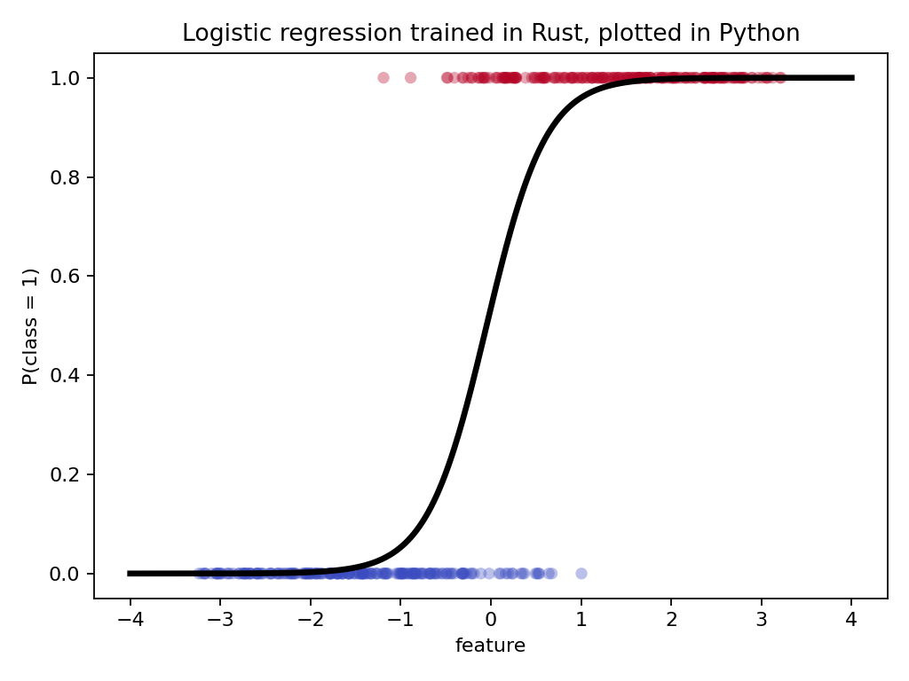

# Crabwalk showcase

These small, reproducible programs demonstrate Crabwalk's current behavior. They
were verified against the local checkout on 2026-08-22 with CPython 3.11 and Rust
1.97.

## The idea

Crabwalk is more than runtime validation or advisory Python type hints. An
explicit subset of Python is lowered into inspectable Rust, compiled as a native
extension, and checked by rustc. Python remains available for FastAPI, NumPy,
Matplotlib, orchestration, and presentation while selected regions gain Cargo
crates, concrete Rust types, native concurrency, and explicit ownership.

Crabwalk owns Cargo project generation, PyO3 wrappers, ABI conversion, panic
containment, artifact caching, and error mapping. That lets application code focus
on its native kernel and Python-facing contract. Generated Cargo projects remain
inspectable, and a kernel that grows into an independently maintained component
can later be extracted into a dedicated Rust crate.

The goal is not to replace Python with Rust or pretend that the languages have
identical semantics. It is to let Python own the application while Rust owns
selected hot, typed, concurrent regions without making the boundary a second
engineering project.

## Precise wording for public claims

| Shorthand | Defensible wording |
|---|---|
| "Crabwalk type-checks Python" | Crabwalk statically checks its supported compiled subset and asks rustc to check the generated Rust; exported values are also validated at runtime boundaries. |
| "Python gets the Rust borrow checker" | rustc checks ownership and borrowing inside generated Rust, while Crabwalk enforces call-scoped move/borrow rules for Rust-backed Python handles at runtime. |
| "Crabwalk releases the GIL" | Eligible native-only functions with supported boundaries release the GIL; functions that touch Python state or hold unsupported borrows do not. |
| "Any crate works from Python" | Cargo dependencies are available when their APIs can be expressed through Crabwalk's supported language and boundary types; a small Rust adapter can flatten more complex APIs. |
| "It turns Python into a reusable Rust crate" | It emits an inspectable generated Cargo project. Stable kernel logic can later be extracted into a purpose-built crate; generated PyO3 wrappers are not presented as a polished public crate API. |
| "It makes Rust as easy as Python" | It offers a Python-shaped workflow for an explicit Rust-semantic subset, while retaining compilation and boundary constraints. |

## Setup

Run from the repository root after installing Crabwalk from this checkout:

```text
python -m pip install -e .
python -m pip install fastapi uvicorn numpy matplotlib
```

Cargo dependencies such as Rayon and `libm` are declared in Python and resolved
by Crabwalk. The first execution compiles a native extension; later executions can
use the verified artifact cache. The compiler's progress meter distinguishes that
cold build from a warm execution.

## Examples

| Example | Main story | Python ecosystem | Rust ecosystem |
|---|---|---|---|
| [`showcase_api.py`](showcase_api.py) | One API combining native concurrency and ML training | FastAPI, Uvicorn, NumPy | Rayon, `libm`, owned vectors |
| [`true_par.py`](true_par.py) | Native types, Rayon concurrency, execution speed | Python timing and reference loop | `Vec<u64>`, tuple return, Rayon |
| [`fastapi_mre.py`](fastapi_mre.py) | Native computation inside an async web API | FastAPI, Uvicorn, asyncio | Rayon, GIL-detached native call |
| [`ml_mre.py`](ml_mre.py) | Train in Rust and analyze/plot in Python | NumPy, Matplotlib | Owned vectors, `libm`, native gradient descent |
| [`etl_rayon.py`](etl_rayon.py) | Non-`Copy` String filter/map/collect pipeline | Python input and reporting | typed Rayon adapters, owned vectors |
| [`structured_etl.py`](structured_etl.py) | Domain rows filtered and grouped in one native call | Python mappings and reporting | `Vec<Sale>`, borrowed iteration, `HashMap` aggregation |

## Structured one-crossing ETL

```text
python examples/showcase/structured_etl.py
```

Python mappings are explicitly allocated as a move-aware `Vec<Sale>`. The native
function borrows each domain row, filters by normalized status, aggregates amounts
into a Rust `HashMap<String, f64>`, and returns one Python dictionary. The script
asserts both the grouped result and that the input handle was consumed. This is a
boundary-composition demonstration; it does not present four rows as a benchmark.

Expected output (dictionary presentation is sorted by the Python shell):

```text
[('midwest', 16.0), ('west', 7.25)]
structured rows moved=True
```

## Typed Rayon String ETL

```text
python examples/showcase/etl_rayon.py
```

This example is the compositional acceptance case that a scalar reduction cannot
stand in for. Python explicitly allocates an owned `Vec<String>`, the native region
moves it, Rayon filters borrowed non-`Copy` items, the map changes each borrowed
row into an owned lowercase `String`, and `collect_vec()` returns the resulting
list. The script asserts both its records and the observable moved state.

The timer measures warm kernel execution when the artifact is cached. It is a
small deterministic correctness demonstration, not an ETL throughput benchmark.

## Unified FastAPI, concurrency, and ML application

[`showcase_api.py`](showcase_api.py) combines the core demonstrations in one
application. It uses port 8001 so it does not conflict with the focused FastAPI
example on port 8000.

```text
python examples/showcase/showcase_api.py
```

Open `http://127.0.0.1:8001/docs`, or call both routes from PowerShell:

```powershell
Invoke-RestMethod 'http://127.0.0.1:8001/parallel?n=5000000'
Invoke-RestMethod 'http://127.0.0.1:8001/ml'
```

The `/parallel` route awaits a scalar-only native kernel that releases the GIL and
uses Rayon. A verified smaller request returned:

```json
{
  "sum": 499999500000,
  "correct": true,
  "rust_ms": 8.23,
  "rayon_workers": 20,
  "gil_released": true
}
```

The default `/ml` route trains the same deterministic logistic-regression model in
Rust, NumPy, and scalar Python. One verified response was:

```json
{
  "model": {"weight": 3.0267, "bias": 0.1459},
  "accuracy": 0.915,
  "training_updates": 2000000,
  "implementations_agree": true,
  "timing_ms": {"rust": 17.43, "numpy": 81.85, "python": 320.02},
  "speedup": {"vs_numpy": 4.7, "vs_python": 18.4},
  "ownership": {"features_moved": true, "labels_moved": true},
  "rust_crate": "libm 0.2"
}
```

FastAPI validates bounded query parameters and exposes both routes through its
generated OpenAPI interface. The ML response makes ownership observable: both
Rust-backed input handles report `moved=true` after training consumes them.
Invalid query values are rejected with HTTP 422 before entering native code.

The JSON reports kernel/training measurements taken inside the request handler;
it excludes compilation, HTTP transport, and JSON serialization. `/ml`
intentionally runs three implementations and is not a production inference route
or an HTTP throughput benchmark.

## Typed native parallel computation

```text
python examples/showcase/true_par.py
```

Representative warm output on the development machine:

```text
Rust/Rayon 0.075s (20 threads) | Python 0.590s | 7.8x
```

`rust.u64`, `rust.usize`, `rust.Vec[rust.u64]`, and the returned tuple become
concrete Rust types. `rust.crate("rayon", version="1.12.0")` becomes a Cargo
dependency, and `par_iter()` performs a real Rayon reduction in a generated
release build. The Python and Rust implementations are checked against the same
closed-form result.

Changing `values.push(value)` to `values.push(3.14)` produces a source-mapped
compiler error because rustc expects `u64` and finds `f64`.

The timer measures function execution, not one-time compilation or module
loading. Results depend on CPU, Rayon worker count, power state, and system load.
The baseline is an explicit Python loop, not NumPy or another native library.

## FastAPI with an asynchronous Rust/Rayon kernel

```text
python examples/showcase/fastapi_mre.py
```

Open `http://127.0.0.1:8000/docs`, or call:

```powershell
Invoke-RestMethod 'http://127.0.0.1:8000/benchmark?n=5000000'
```

Representative response:

```json
{
  "sum": 12499997500000,
  "rust_ms": 52.77,
  "python_ms": 344.74,
  "speedup": 6.5,
  "gil_released": true
}
```

FastAPI performs HTTP parsing, query validation, OpenAPI generation, and JSON
serialization. `await rust.async_call(...)` schedules the eligible native call
away from the event loop, and Rayon parallelizes the reduction inside that call.
No handwritten PyO3 module or separate extension build script appears in the
application.

This is deliberately a benchmark endpoint: it calculates both implementations
so their results and timings can be returned together. The Python reference also
runs through a worker thread. Reported values exclude network transport and JSON
serialization and are not an HTTP throughput benchmark.

## Logistic regression trained in Rust and plotted in Python

```text
python examples/showcase/ml_mre.py
```

Representative verified output:

```text
accuracy=91.5% | Rust 21.0ms | NumPy 115.9ms | Python 343.9ms
speedup: 5.5x vs NumPy, 16.4x vs Python
```

Across four local runs, measured speedup ranged from 3.4–5.5x over the vectorized
NumPy implementation and 8.7–17.6x over equivalent scalar Python loops. Exact
results are machine- and load-dependent.

The script writes [`ml_decision_curve.png`](ml_decision_curve.png) and opens a
Matplotlib window.



NumPy generates deterministic noisy training data and evaluates the fitted model.
Python lists are explicitly converted to Rust-backed `Vec<f64>` handles;
`rust.Owned[rust.Vec[rust.f64]]` then transfers those handles into the training
function. The typed kernel performs 5,000 gradient-descent epochs over 400 samples:
two million training-example updates in native Rust. The crates.io `libm`
dependency supplies the exponential, and `(weight, bias)` crosses back as a typed
Rust tuple.

Timers begin after module compilation, data generation, list conversion, and Rust
vector construction. They measure only training; evaluation and plot construction
are excluded. The NumPy baseline uses vectorized operations but still has one
Python-level loop per epoch. This is an educational one-dimensional model, not a
replacement claim for scikit-learn, PyTorch, or optimized BLAS-backed training.

## What these examples establish

These examples demonstrate that Crabwalk can compile an explicit Python subset
into a native Rust extension, ask rustc to check the generated program, resolve
Cargo crates, preserve explicit ownership rules, use real native concurrency,
detach eligible work from the GIL, and compose the result with ordinary Python
packages.

They do not by themselves establish universal performance, arbitrary Python or
Cargo compatibility, production web throughput, or production-grade machine
learning. Cold compilation and warm native execution should always be reported
separately. Cross-platform release evidence lives in the repository's
[compatibility and verification guide](../../Docs/Crabwalk%20Compatibility%20and%20Verification.md).
